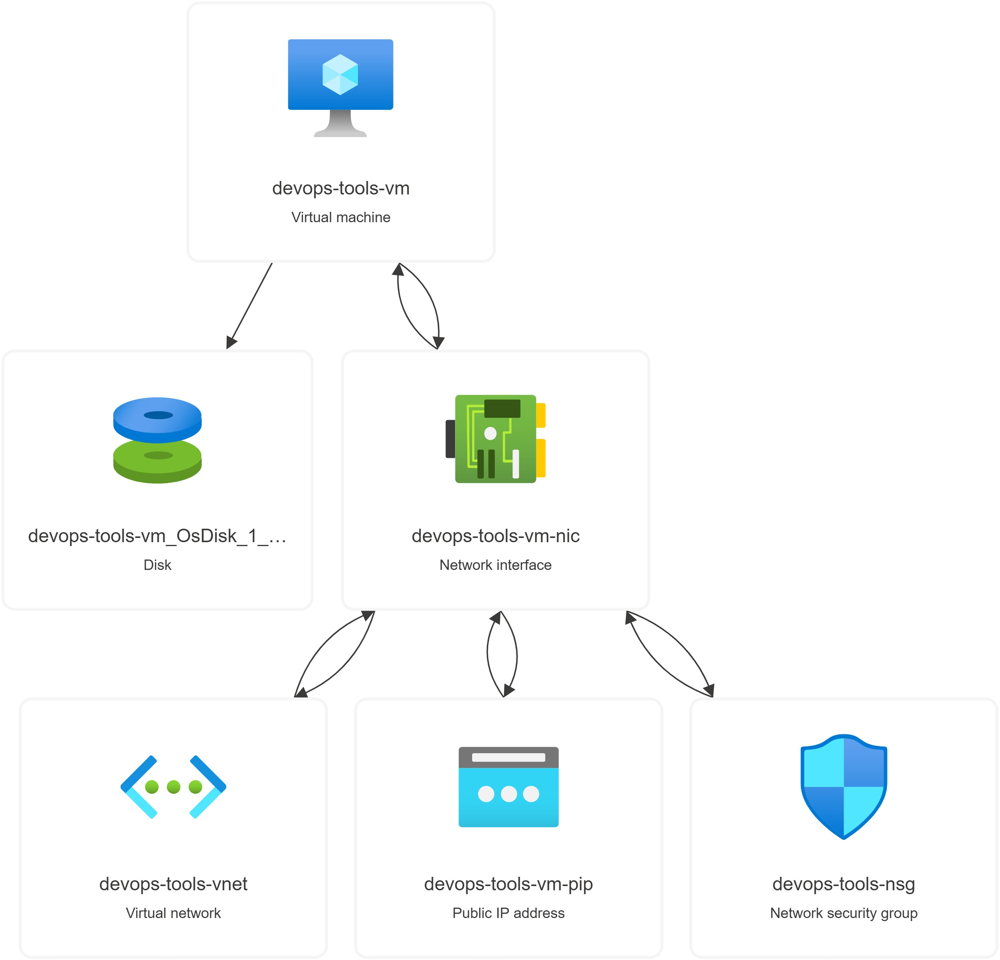

# Azure Windows DevOps Environment Terraform Project

## Prerequisites
- Azure CLI
- Terraform
- Active Azure subscription
- Windows OS (for testing Docker Desktop locally)## Project Overview


## Project Overview
This project demonstrates the automated deployment of a Windows development environment in Azure using Terraform. It creates a fully configured Windows 10 VM with essential DevOps tools pre-installed, making it ideal for development and testing scenarios.



### Key Features
- Windows 10 Pro VM with Docker Desktop
- Automated tool installation via Chocolatey
- Secure networking configuration
- RDP access for remote management

## Infrastructure Benefits
- **Automation**: Complete environment setup using Infrastructure as Code
- **Reproducibility**: Consistent development environment across team members
- **Security**: Properly configured network security groups
- **Modularity**: Terraform code organized in reusable modules

## Infrastructure Components
- Resource Group
- Virtual Network and Subnet
- Network Security Group
- Windows 10 VM with:
  - Docker Desktop
  - Git
  - Visual Studio Code
  - Python
  - Terraform
  - Kubernetes CLI
  - Helm

## Project Structure
```
devops-tools/
├── main.tf                  # Main configuration file
├── variables.tf            # Variable definitions
├── terraform.tfvars        # Variable values
├── modules/
│   ├── resource_group/     # Resource group module
│   ├── network/           # Network configuration
│   ├── security/          # Security rules
│   └── vm/                # Windows VM configuration
└── scripts/
    └── install_devops_tools.ps1
```

## Setup Instructions

1. Clone the repository:
```bash
git clone <repository-url>
cd devops-tools
```

2. Create terraform.tfvars:
```hcl
resource_group_name = "your-rg-name"
location = "eastus"
project_name = "devops-tools"
admin_username = "your-username"
admin_password = "YourSecurePassword123!"
```

3. Initialize and apply Terraform:
```bash
terraform init
terraform plan
terraform apply
```

4. Access the VM:
- Use Remote Desktop Protocol (RDP)
- Connect using the VM's public IP (available in Terraform outputs)
- Login with credentials specified in terraform.tfvars

## Security Considerations
- Strong password requirements enforced
- Network Security Group limiting access
- RDP port (3389) exposed for remote access
- Regular Windows updates enabled

## Clean Up
To remove all created resources:
```bash
terraform destroy
```


